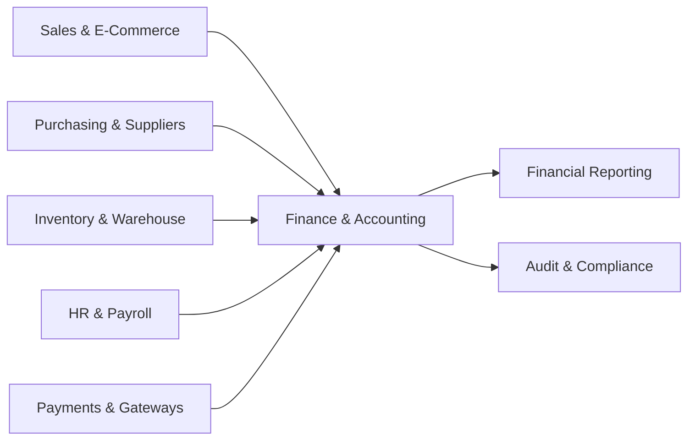
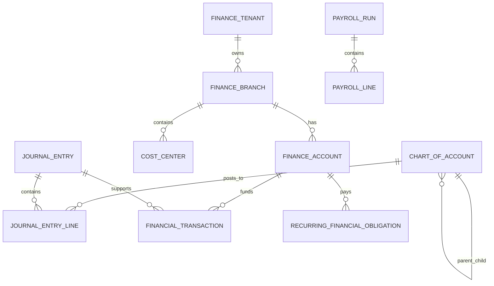

# Enterprise Financial Management Module

This document converts the existing frontend-only finance concept (`Branch`, `FinancialAccount`, `Transaction`, `RecurringBill`, `PayrollEntry`, `FinanceSummary`, `CashFlowPoint`, `BranchPerformance`) into a production-grade accounting module for supermarkets, chain stores, hypermarkets, warehouses, and e-commerce.

## 1. Current model gaps

The current frontend models are useful for dashboards, but they are not enough for real accounting because they store operational transactions directly as income or expense rows. Missing concepts:

- **Tenant/legal entity** for multi-company or franchise deployments.
- **Double-entry bookkeeping** with balanced debit and credit journal lines.
- **Chart of accounts** for assets, liabilities, equity, revenue, and expenses.
- **General ledger** and immutable posted journal entries.
- **Accounting periods** and period close controls.
- **Cost centers** for branches, warehouses, departments, e-commerce, delivery, marketing, payroll, and IT.
- **Source document linkage** to sales orders, purchase orders, supplier invoices, refunds, payroll, bills, transfers, tax, inventory adjustments, and payment gateways.
- **Approval and audit trail** with who approved, when, and what changed.
- **Multi-currency accounting** with base-currency conversion.
- **Reversals instead of destructive edits** after posting.
- **Financial reporting views** for balance sheet, profit and loss, cash flow, trial balance, aging, and branch profitability.

## 2. Bounded contexts



### Finance bounded context

Aggregate roots implemented in this repository:

- `FinanceTenant`: legal tenant/company.
- `FinanceBranch`: branch, online store, warehouse, or head office accounting dimension.
- `ChartOfAccount`: hierarchical account tree.
- `FinanceAccount`: cash, bank, gateway, wallet, petty cash, and clearing accounts mapped to ledger accounts.
- `JournalEntry`: general-ledger posting header.
- `FinancialTransaction`: operational money movement linked to source documents and journal entries.
- `RecurringFinancialObligation`: rent, insurance, utilities, taxes, servers, subscriptions, and other scheduled costs.
- `PayrollRun`: payroll batch with employee payroll lines.

## 3. Accounting rules

1. Every posted journal entry must contain at least two lines.
2. Total debit must equal total credit in the transaction currency and base currency.
3. Posted entries are immutable; corrections must be reversal entries.
4. Operational events create draft or pending journal entries first; posting happens only after validation/approval.
5. Cash/bank/gateway balances are derived from ledger postings and reconciliations, not manually trusted UI values.
6. Accounting periods block posting after close unless a privileged reopening workflow is executed.
7. Multi-branch reports are filtered by branch and cost center dimensions, while statutory reports are consolidated by tenant.

## 4. Double-entry examples

### Online sale paid by payment gateway

| Account | Debit | Credit |
| --- | ---: | ---: |
| Payment Gateway Clearing | Gross order amount |  |
| Sales Revenue |  | Net merchandise revenue |
| VAT Payable |  | Output tax |

### Gateway settlement to bank with fee

| Account | Debit | Credit |
| --- | ---: | ---: |
| Bank Account | Settled amount |  |
| Gateway Fee Expense | Gateway fee |  |
| Payment Gateway Clearing |  | Gross settlement |

### Supplier purchase invoice

| Account | Debit | Credit |
| --- | ---: | ---: |
| Inventory | Goods cost |  |
| Input VAT Receivable | VAT |  |
| Accounts Payable |  | Invoice total |

### Payroll approval

| Account | Debit | Credit |
| --- | ---: | ---: |
| Salary Expense | Gross salary |  |
| Bonus Expense | Bonus |  |
| Payroll Tax Payable |  | Tax withheld |
| Insurance Payable |  | Insurance withheld |
| Salaries Payable |  | Net pay |

## 5. Database schema overview



## 6. Oracle DDL blueprint

The EF model currently targets SQL Server in this repository, but the enterprise target can be generated for Oracle with equivalent types:

```sql
CREATE TABLE FINANCE_TENANTS (
  ID VARCHAR2(64) PRIMARY KEY,
  NAME NVARCHAR2(200) NOT NULL,
  CODE VARCHAR2(40) NOT NULL UNIQUE,
  BASE_CURRENCY NUMBER(3) NOT NULL,
  IS_ACTIVE NUMBER(1) DEFAULT 1 NOT NULL,
  CREATED_BY VARCHAR2(128),
  CREATED_TIME TIMESTAMP DEFAULT SYSTIMESTAMP NOT NULL,
  MODIFIED_BY VARCHAR2(128),
  MODIFIED_TIME TIMESTAMP DEFAULT SYSTIMESTAMP NOT NULL,
  IS_DELETED NUMBER(1) DEFAULT 0 NOT NULL
);

CREATE TABLE CHART_OF_ACCOUNTS (
  ID VARCHAR2(64) PRIMARY KEY,
  TENANT_ID VARCHAR2(64) NOT NULL,
  CODE VARCHAR2(80) NOT NULL,
  NAME NVARCHAR2(250) NOT NULL,
  TYPE NUMBER(3) NOT NULL,
  NORMAL_BALANCE NUMBER(3) NOT NULL,
  PARENT_ACCOUNT_ID VARCHAR2(64),
  IS_POSTING_ALLOWED NUMBER(1) DEFAULT 1 NOT NULL,
  IS_SYSTEM_ACCOUNT NUMBER(1) DEFAULT 0 NOT NULL,
  IS_ACTIVE NUMBER(1) DEFAULT 1 NOT NULL,
  CONSTRAINT UX_COA_TENANT_CODE UNIQUE (TENANT_ID, CODE),
  CONSTRAINT FK_COA_PARENT FOREIGN KEY (PARENT_ACCOUNT_ID) REFERENCES CHART_OF_ACCOUNTS(ID)
);

CREATE TABLE JOURNAL_ENTRIES (
  ID VARCHAR2(64) PRIMARY KEY,
  TENANT_ID VARCHAR2(64) NOT NULL,
  JOURNAL_NUMBER VARCHAR2(80) NOT NULL,
  ACCOUNTING_DATE TIMESTAMP NOT NULL,
  STATUS NUMBER(3) NOT NULL,
  SOURCE_DOCUMENT_TYPE NUMBER(3) NOT NULL,
  SOURCE_DOCUMENT_ID VARCHAR2(128),
  BRANCH_ID VARCHAR2(64),
  DESCRIPTION NVARCHAR2(1000),
  POSTED_ON TIMESTAMP,
  POSTED_BY VARCHAR2(128),
  REVERSAL_OF_JOURNAL_ENTRY_ID VARCHAR2(64),
  CONSTRAINT UX_JE_TENANT_NUMBER UNIQUE (TENANT_ID, JOURNAL_NUMBER)
);

CREATE TABLE JOURNAL_ENTRY_LINES (
  ID VARCHAR2(64) PRIMARY KEY,
  JOURNAL_ENTRY_ID VARCHAR2(64) NOT NULL,
  LEDGER_ACCOUNT_ID VARCHAR2(64) NOT NULL,
  COST_CENTER_ID VARCHAR2(64),
  BRANCH_ID VARCHAR2(64),
  DEBIT_AMOUNT NUMBER(18,2) DEFAULT 0 NOT NULL,
  CREDIT_AMOUNT NUMBER(18,2) DEFAULT 0 NOT NULL,
  CURRENCY NUMBER(3) NOT NULL,
  EXCHANGE_RATE_TO_BASE NUMBER(18,8) DEFAULT 1 NOT NULL,
  DESCRIPTION NVARCHAR2(1000),
  CONSTRAINT FK_JEL_ENTRY FOREIGN KEY (JOURNAL_ENTRY_ID) REFERENCES JOURNAL_ENTRIES(ID),
  CONSTRAINT FK_JEL_ACCOUNT FOREIGN KEY (LEDGER_ACCOUNT_ID) REFERENCES CHART_OF_ACCOUNTS(ID),
  CONSTRAINT CK_JEL_ONE_SIDE CHECK ((DEBIT_AMOUNT > 0 AND CREDIT_AMOUNT = 0) OR (CREDIT_AMOUNT > 0 AND DEBIT_AMOUNT = 0))
);
```

Add Oracle indexes for scale:

```sql
CREATE INDEX IX_JE_TENANT_DATE ON JOURNAL_ENTRIES(TENANT_ID, ACCOUNTING_DATE);
CREATE INDEX IX_JEL_ACCOUNT ON JOURNAL_ENTRY_LINES(LEDGER_ACCOUNT_ID, JOURNAL_ENTRY_ID);
CREATE INDEX IX_JEL_BRANCH_COST ON JOURNAL_ENTRY_LINES(BRANCH_ID, COST_CENTER_ID);
```

## 7. API contracts

Recommended endpoints:

- `GET /api/finance/overview?tenantId=&branchId=&from=&to=`
- `GET /api/finance/chart-of-accounts`
- `POST /api/finance/chart-of-accounts`
- `GET /api/finance/journal-entries`
- `POST /api/finance/journal-entries/draft`
- `POST /api/finance/journal-entries/{id}/submit`
- `POST /api/finance/journal-entries/{id}/approve`
- `POST /api/finance/journal-entries/{id}/post`
- `POST /api/finance/journal-entries/{id}/reverse`
- `GET /api/finance/transactions`
- `POST /api/finance/transactions`
- `GET /api/finance/reports/trial-balance`
- `GET /api/finance/reports/profit-and-loss`
- `GET /api/finance/reports/balance-sheet`
- `GET /api/finance/reports/cash-flow`
- `GET /api/finance/reports/branch-performance`
- `GET /api/finance/reports/accounts-payable-aging`
- `GET /api/finance/reports/accounts-receivable-aging`

## 8. Frontend architecture

Keep your existing dashboard pages, but evolve them into these feature folders:

```text
src/features/finance/
  api/financeApi.ts
  models/financeTypes.ts
  pages/FinanceOverview.tsx
  pages/FinanceTransactions.tsx
  pages/FinanceJournalEntries.tsx
  pages/FinanceChartOfAccounts.tsx
  pages/FinanceReports.tsx
  pages/FinanceApprovals.tsx
  components/JournalEntryForm.tsx
  components/JournalLineGrid.tsx
  components/TrialBalanceTable.tsx
  components/FinancialKpiGrid.tsx
```

Frontend model additions should include `ChartOfAccount`, `JournalEntry`, `JournalEntryLine`, `CostCenter`, `AccountingPeriod`, `FinancialApprovalLog`, and `FinancialAuditLog`. Use decimal strings from the API for money if JavaScript number precision becomes a risk.

## 9. Reporting architecture

- Use normalized ledger tables as source of truth.
- Build read models/materialized views for dashboard speed.
- Partition large journal and transaction tables by tenant and accounting date.
- Use asynchronous projections from domain events such as `OrderPaid`, `SupplierInvoiceApproved`, `PayrollRunApproved`, and `BillAutoPaid`.
- Cache read-only dashboards, but never cache posting validation decisions.

## 10. Security and permissions

Suggested permissions:

- `finance.accounts.read/manage`
- `finance.transactions.read/create/approve/reverse`
- `finance.journals.read/create/submit/approve/post/reverse`
- `finance.payroll.read/manage/approve/pay`
- `finance.reports.read/export`
- `finance.periods.close/reopen`
- `finance.audit.read`

Segregation of duties: the user who creates a high-value transaction should not be the only approver or poster.

## 11. Implementation roadmap

1. Add domain entities and EF configurations for tenants, branches, COA, finance accounts, cost centers, journal entries, transactions, recurring obligations, payroll, approvals, and audit logs.
2. Add repositories and CQRS commands/queries for chart of accounts and journal posting.
3. Implement posting service with debit/credit balancing, closed-period validation, source-document idempotency, and reversal logic.
4. Add Oracle migrations/scripts and indexing/partitioning strategy.
5. Replace mock frontend finance service with typed API client.
6. Add journal entry, chart of accounts, approval queue, and reports pages.
7. Add event consumers for sales, refunds, purchases, payroll, gateway settlements, inventory adjustments, taxes, and bills.
8. Add reporting projections and export support.
9. Add audit dashboards and financial permission policies.
10. Load-test posting and reporting with millions of journal lines before production.
